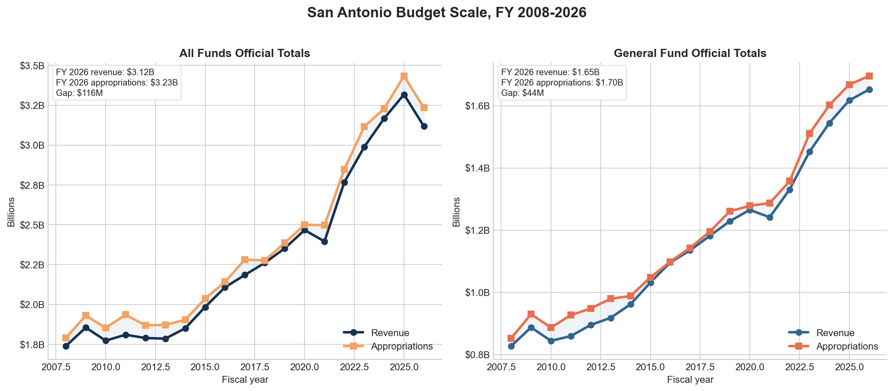
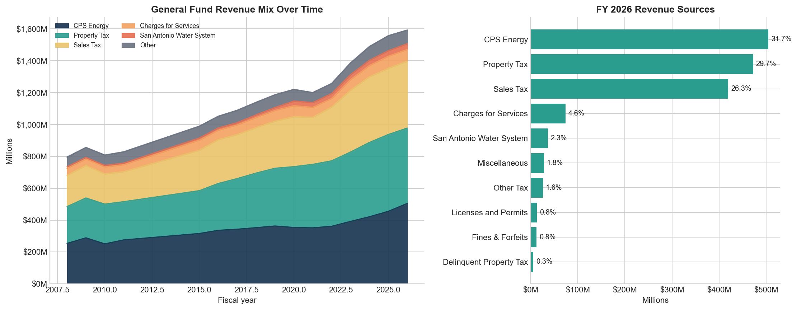
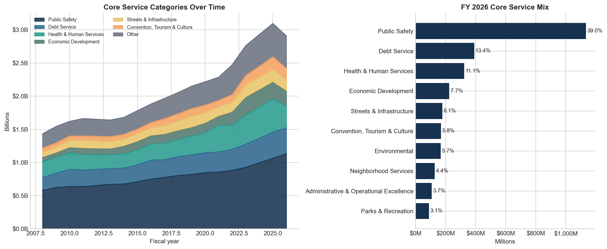
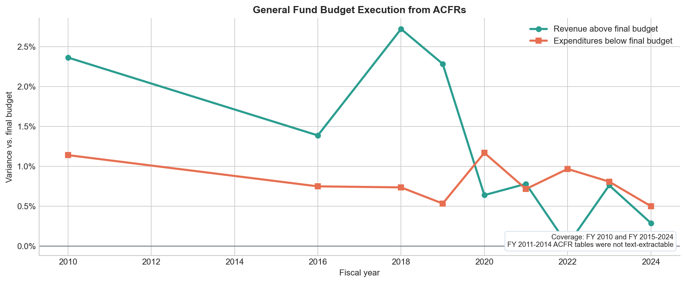
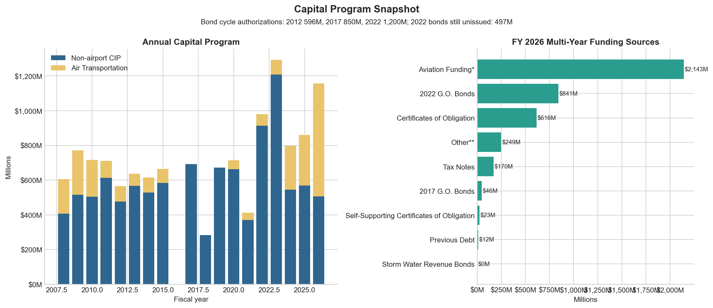

# San Antonio Budget Data Executive Summary

Generated from the current project outputs on 2026-03-11.

San Antonio does not publish the core budget and financial statements in machine-readable tabular form. The operating budget, capital program, and ACFR figures used here were reconstructed from adopted budget PDFs and ACFR PDFs by custom scrapers in this project.

## Headline findings

- Core all-funds appropriations rose from $1.43B in FY 2008 to $2.91B in FY 2026, a 103% increase (4.0% CAGR).
- The General Fund remains structurally concentrated: CPS Energy, property tax, and sales tax account for 87.7% of FY 2026 core revenue categories.
- Public Safety is still the dominant service area at 39.0% of FY 2026 core appropriations, with debt service the next-largest category at 13.4%.
- Budget execution is tight in every usable ACFR year: actual General Fund revenue beat final budget by an average of 1.2%, while actual expenditures finished 0.8% below final budget on average.
- The capital program has expanded from $0.61B annually in FY 2008 to $1.16B in FY 2026. In the current six-year plan, aviation alone represents 52.3% of multi-year capital spending, and the 2022 bond program still has $497M unissued.

## Visuals

Official totals from the adopted budget tables. The FY 2026 gap between revenues and appropriations represents planned use of transfers, balances, and reserves rather than an ACFR-style actual deficit.

The General Fund is unusually dependent on utility revenue: CPS Energy alone is 31.7% of FY 2026 core revenue, and CPS plus SAWS together contribute 34.0%.

Service-category charts exclude transfer, reserve, and ending-balance rows so category shares are not distorted by bookkeeping lines.

The ACFR extract is the cleanest evidence of execution quality, but it only covers FY 2010 and FY 2015-FY 2024 because FY 2011-FY 2014 ACFR tables were not text-extractable.

The capital plan is now airport-led. Excluding aviation, streets, parks, and drainage still account for 69.8% of the remaining FY 2026 multi-year CIP. Annual CIP bars are built from direct category sums because a few annual `Total` rows are inconsistent.

## Data review

| Dataset | Coverage | Used in this brief | Review note |
| --- | --- | --- | --- |
| `combined_budget_summary.csv` | FY 2008-FY 2026 | Yes | Reconstructed from adopted budget PDFs. Strongest operating-budget file once transfers and reserve rows are separated from service categories. |
| `acfr_budget_vs_actual.csv` | FY 2010 and FY 2015-FY 2024 | Yes | Reconstructed from ACFR PDFs. Good execution dataset within coverage, but FY 2011-FY 2014 tables were not text-extractable. |
| `cip_categories.csv`, `cip_revenue_sources.csv`, `bond_status.csv` | FY 2008-FY 2026 / FY 2011-FY 2026 / FY 2015-FY 2026 | Yes | Reconstructed from budget PDFs. Strong enough for capital trends. Bond-cycle transitions need `max authorized` logic, and a few annual CIP `Total` rows are cleaner when rebuilt from category sums. |
| `general_fund_departments.csv` | FY 2008-FY 2026 | No | Reconstructed from budget PDFs, but not reliable enough for headline use. Total rows fail reconciliation against the combined summary in many years, and FY 2024 plus FY 2026 contain obvious non-department artifacts. |
| `all_funds_revenue.csv` | FY 2008-FY 2026 | No | Reconstructed from budget PDFs. Useful for exploration only after normalization; fund labels are inconsistent, and some latest-year fund totals appear incomplete. |
| `Check Disbursements_03_10_2026.csv` | Mixed fiscal coverage | No | Raw export with a preamble row and incomplete period coverage. The project notebook notes FY 2025 is the only complete fiscal year in that file. |

## Recommendations

- Add row-level validation and cross-file reconciliation tests to the PDF scrapers so totals in `general_fund_departments.csv` and `all_funds_revenue.csv` are checked automatically against `combined_budget_summary.csv`.
- Treat `combined_budget_summary.csv` as the canonical source for executive trend reporting until the department and granular-revenue scrapes are hardened.
- Convert the disbursement export into a processed table with a fixed schema, completeness flags by fiscal year, and documented exclusions so transaction-level analysis can join cleanly to the budget data.
